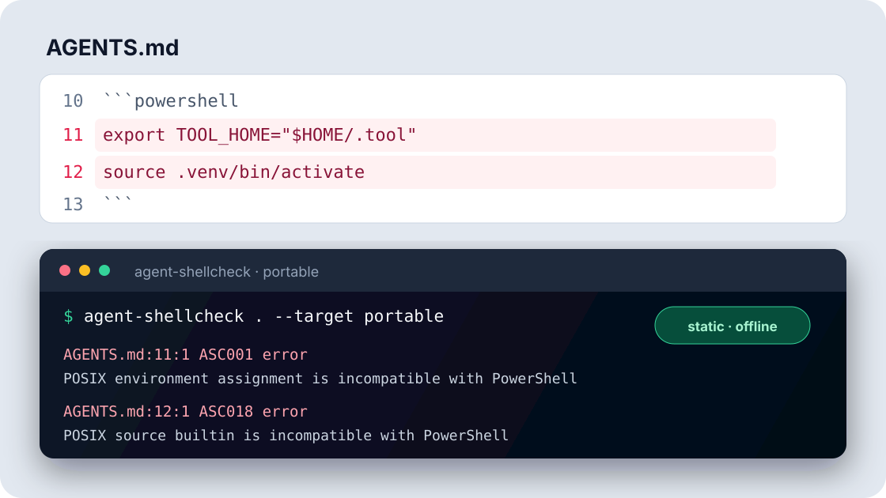

<div align="center">
  
  <h1>agent-shellcheck</h1>
  <p><strong>ShellCheck for AGENTS.md and SKILL.md.</strong></p>
  <p>Catch Bash, PowerShell, cmd, path, and WSL portability bugs before your users do.</p>
  <p>
    <a href="https://github.com/cuijialin8888-code/agent-shellcheck/actions/workflows/ci.yml"></a>
    
    
    <a href="LICENSE"></a>
  </p>
  <p><a href="README.zh-CN.md">简体中文</a> · <a href="#30-second-start">Quick start</a> · <a href="docs/cli.md">CLI</a> · <a href="docs/rules.md">Rules</a> · <a href="docs/ci.md">CI</a></p>
</div>

Agent instructions are executable documentation. A perfectly reasonable setup
block for Bash can fail immediately in PowerShell; a native-Windows command can
mislead someone using WSL; an unlabeled cleanup command can be worse than a
failed install. `agent-shellcheck` finds these problems at the file and line
where they enter your repository.

It is a zero-runtime-dependency Python CLI. Scans are static, offline,
read-only by default, and deterministic. **Discovered commands are never
executed.**

<p align="center">
  
</p>

## 30-second start

Run directly from the repository release:

```console
uvx --from git+https://github.com/cuijialin8888-code/agent-shellcheck.git agent-shellcheck .
```

Or install an isolated CLI:

```console
pipx install git+https://github.com/cuijialin8888-code/agent-shellcheck.git
agent-shellcheck .
```

When the package is available from PyPI, the shorter forms are
`pipx install agent-shellcheck` and `uvx agent-shellcheck .`.

No configuration is required. Directory scans discover common instruction
files and print sorted diagnostics with stable rule IDs:

```text
AGENTS.md:11:1  ASC001  error  POSIX environment assignment is incompatible with PowerShell on Windows
AGENTS.md:12:1  ASC018  error  POSIX source builtin is incompatible with PowerShell on Windows

2 errors, 0 warnings, 0 info in 1 file
```

## What it catches

| Failure mode | Example signal |
|---|---|
| Fence and command disagree | `export ...` inside a <code>```powershell</code> block |
| Environment syntax is platform-bound | `$env:NAME`, `%NAME%`, or `export NAME=...` in portable instructions |
| Continuation syntax belongs to another shell | POSIX `\`, PowerShell backtick, or cmd caret under the wrong label |
| Multiline input is shell-specific | POSIX heredoc or PowerShell here-string in a conflicting block |
| Paths assume the wrong host | `C:\...`, `.\scripts\...`, or the wrong virtual-environment activation path |
| Command signature is shell-specific | `sudo`, a PowerShell cmdlet, or a cmd.exe built-in in portable instructions |
| Redirection is platform-bound | `/dev/null` or PowerShell `$null` redirection under the wrong shell |
| Windows execution is mistaken for WSL execution | Calling a batch file directly from a WSL Bash block |

The initial catalog contains 20 focused diagnostics. Each finding includes an
exact source location, evidence, affected shells, and practical help. See the
[rule reference](docs/rules.md).

## Real problem, small tool

General Markdown linters can validate structure and style. Shell-specific tools
can deeply analyze a `.sh` or `.ps1` file. Neither has enough document context
to answer all of these questions:

- Is a command fenced as the shell it actually uses?
- Is this unlabeled setup intended to be portable?
- Are Linux, WSL, and native Windows being treated as distinct targets?
- Does a platform-specific path have a clearly labelled alternative?

`agent-shellcheck` stays in that narrow gap. Use it alongside ShellCheck,
PSScriptAnalyzer, tests, and security review—not as a replacement for them.

## Usage

Scan the current repository with inferred targets:

```console
agent-shellcheck .
```

Require portable instructions across native Windows and POSIX environments:

```console
agent-shellcheck AGENTS.md skills/ --target portable
```

Evaluate generic snippets for one environment:

```console
agent-shellcheck . --target powershell-windows
agent-shellcheck . --target bash-wsl
```

Produce automation-friendly reports:

```console
agent-shellcheck . --format json --output report.json
agent-shellcheck . --format sarif --output report.sarif
agent-shellcheck . --format html --output report.html
agent-shellcheck . --format github
```

Tune CI policy without changing the reported evidence:

```console
agent-shellcheck . --min-severity warning --fail-on warning
agent-shellcheck . --ignore ASC012 --exclude "vendor/**" --max-files 500
```

The default failure threshold is `error`. `--min-severity` controls what is
shown, while `--fail-on` controls when a completed scan returns a failing status.

Run `agent-shellcheck --help` or open the [CLI reference](docs/cli.md) for the
complete command contract.

### Repository policy

Commit a `.agent-shellcheck.json` file to keep local runs and CI on one policy:

```json
{
  "$schema": "https://raw.githubusercontent.com/cuijialin8888-code/agent-shellcheck/v0.2.0/schemas/config.schema.json",
  "version": 1,
  "target": "portable",
  "minSeverity": "warning",
  "failOn": "error",
  "exclude": ["generated/**", "vendor/**"]
}
```

CLI flags override repository values. `agent-shellcheck --show-config` explains
the effective policy without scanning, and `--no-config` provides a clean
diagnostic bypass. See [repository configuration](docs/configuration.md).

### Targets

| Target | Interpretation of generic or unlabeled command snippets |
|---|---|
| `auto` | Infer from fence labels and context; otherwise expect portability. |
| `portable` | Check native Windows and POSIX usability, allowing labelled alternatives. |
| `bash-linux` | Bash running on Linux. |
| `bash-wsl` | Bash running under Windows Subsystem for Linux. |
| `powershell-windows` | PowerShell running on native Windows. |
| `cmd-windows` | cmd.exe running on native Windows. |

The distinction matters: `/mnt/c/project` is natural in WSL, but it is not a
Linux-server path or a native-Windows path.

### Inputs

Directory discovery recognizes:

- `AGENTS.md`, `AGENTS.override.md`, and `SKILL.md`
- `CLAUDE.md`, `CLAUDE.local.md`, and `GEMINI.md`
- `.cursorrules`, `.clinerules`, `*.instructions.md`, and `*.mdc`

You can also pass an explicit Markdown file. Dependency, cache, build, virtual
environment, and version-control directories are skipped. Symbolic links are
not followed during discovery.

### Outputs

| Format | Use case |
|---|---|
| `text` | Fast local feedback |
| `json` | Versioned programmatic results |
| `sarif` | GitHub code-scanning annotations |
| `markdown` | Job summaries and review comments |
| `html` | A self-contained offline report |
| `github` | Native GitHub Actions annotations |

Read the [output contract](docs/outputs.md) or copy a ready-to-pin
[GitHub Actions workflow](docs/ci.md).

The repository also ships a zero-Node composite action:

```yaml
- uses: cuijialin8888-code/agent-shellcheck@v0.2.0
  with:
    args: ". --target portable --format github"
```

With v0.2, omitting `args` scans the repository and emits native annotations by
default. The action automatically honors `.agent-shellcheck.json`.

## Why teams can trust the scan

- **No command execution.** Command-looking content stays data.
- **No runtime network access.** Analysis uses the Python standard library.
- **No source rewrite.** Only an explicitly requested report path is written.
- **Stable evidence.** Files and findings are sorted; rule IDs are durable.
- **Bounded discovery.** Symlinks, dependency trees, caches, and oversized files
  are not recursively consumed.
- **Visible limitations.** This is a focused portability linter, not an all-shell
  parser, prompt-injection detector, or complete security scanner.

The full threat model and non-goals are in [design and trust model](docs/design.md).

## A portable instruction is usually clearer

Instead of hiding one platform assumption:

````markdown
```console
source .venv/bin/activate
```
````

Label the alternatives:

````markdown
**Bash (Linux or WSL)**

```bash
. .venv/bin/activate
```

**PowerShell (Windows)**

```powershell
. .venv\Scripts\Activate.ps1
```
````

The goal is not to force every command into a lowest-common-denominator shell.
It is to make the required environment explicit and give readers a usable path.

## Contributing

False-positive reports are especially valuable. A good rule contribution has a
minimal triggering example, a nearby non-triggering example, and a primary
platform reference. Start with [CONTRIBUTING.md](CONTRIBUTING.md) or use the
repository's structured issue forms.

## License

[MIT](LICENSE) · Built for people and coding agents who work across shells.
